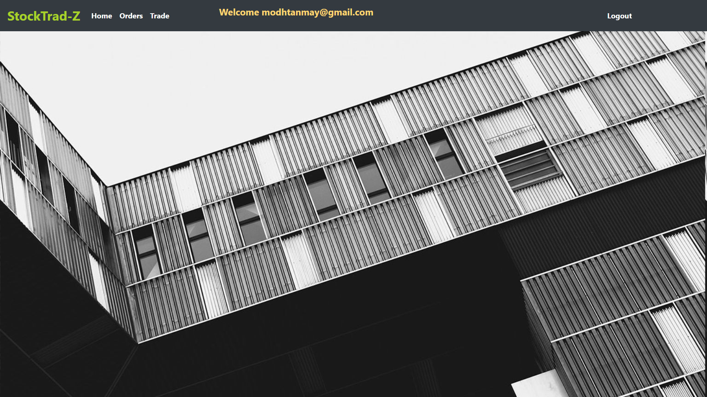
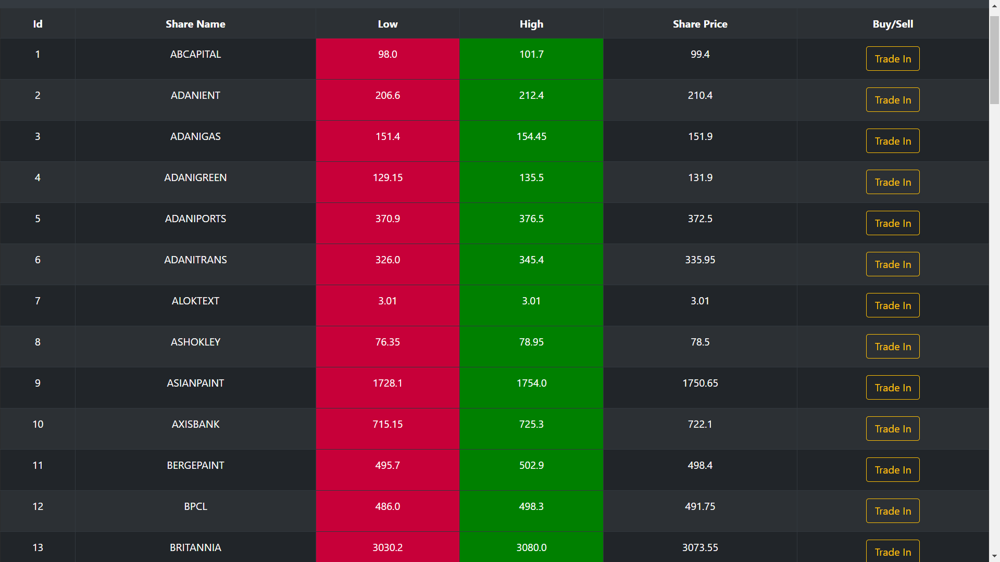
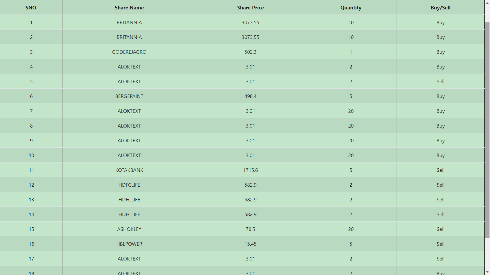

# StockTrad-Z
StockTrad-Z can do the following activity:
1. Display list of stocks with their current share price 
2. Buy or sell selected stock in specified quantity. 
3. Calculate order amount and brokers commission

# Output Screens
## Landing Page
This page is been made using [HTML](https://developer.mozilla.org/en-US/docs/Web/HTML#:~:text=HTML%20(HyperText%20Markup%20Language)%20is,functionality%2Fbehavior%20(JavaScript).), 
[CSS](https://developer.mozilla.org/en-US/docs/Web/CSS), [BOOTSTRAP](https://getbootstrap.com/) and [THEMELEAF](https://www.thymeleaf.org/).

## Welcome Page
This page is static for now but can be used to get news api and showing stock market news live.

## Stocks Page
The data used here is from database which you can find here [Stocks](https://github.com/modhtanmay/Stock-Trading-Management/blob/master/Share-Data/Sql%20Scripts/shares.sql). The improvement can be done where the data is dynamic using some stocks Apis. (will update it with necessary changes)

## Orders Page
Here the list of orders are seen which the trader traded from stocks Page.   This is linked to database (For project management of data is using [JPA](https://spring.io/projects/spring-data-jpa) and database is [MySql Workbench](https://www.mysql.com/products/workbench/))

# Technologies Used

### Database
[MySql](https://www.mysql.com/products/workbench/) : MySQL Workbench is a visual database design tool that integrates SQL development, administration, database design, creation and maintenance into a single integrated development environment for the MySQL database system.

### Scripting
[JavaScript](https://www.javascript.com/) : JavaScript, often abbreviated as JS, is a programming language that conforms to the ECMAScript specification. JavaScript is high-level, often just-in-time compiled, and multi-paradigm. It has curly-bracket syntax, dynamic typing, prototype-based object-orientation, and first-class functions.

[JSP](https://www.tutorialspoint.com/jsp/index.htm) : JavaServer Pages (JSP) is a technology for developing Webpages that supports dynamic content. This helps developers insert java code in HTML pages by making use of special JSP tags, most of which start with <% and end with %>.

### FrontEnd
[HTML/CSS](https://www.w3schools.com/html/) : Hypertext Markup Language is the standard markup language for documents designed to be displayed in a web browser. It can be assisted by technologies such as Cascading Style Sheets and scripting languages such as JavaScript.

[BootStrap](https://getbootstrap.com/) : Bootstrap is a free and open-source CSS framework directed at responsive, mobile-first front-end web development. It contains CSS- and JavaScript-based design templates for typography, forms, buttons, navigation, and other interface components.

### BackEnd
[Java](https://www.java.com/) : Java is a general-purpose programming language that is class-based, object-oriented, and designed to have as few implementation dependencies as possible.

[Spring MVC](https://docs.spring.io/spring/docs/3.2.x/spring-framework-reference/html/mvc.html) : The Spring Web MVC framework provides Model-View-Controller (MVC) architecture and ready components that can be used to develop flexible and loosely coupled web applications.

[Spring Boot](https://spring.io/projects/spring-boot) : Spring Boot is a project that is built on the top of the Spring Framework. It provides an easier and faster way to set up, configure, and run both simple and web-based applications. It is a Spring module that provides the RAD (Rapid Application Development) feature to the Spring Framework.

# Setup Required
- Eclipse / Intellij IDE
- JDK (jdk 10 and above)
- JRE(any latest versions)
- Tomcat Server
- Web Browser(Google Crome, Mozilla Firefox, Microsoft Edge)

# Running the Project
- Clone the repository as a maven project.
- Import all the dependencies.
- Run Application.java to run the application.
- You will see the processing and verification of the process during the Application run.
- Open Browser and Type in [localhost:{server_port}](https://locallhost.com/).  (Server Port Depends on local System you can change it by going here [server.port](https://github.com/modhtanmay/Stock-Trading-Management/blob/master/Share-Data/src/main/resources/application.properties))
- That's it You are Good to go!!!.
