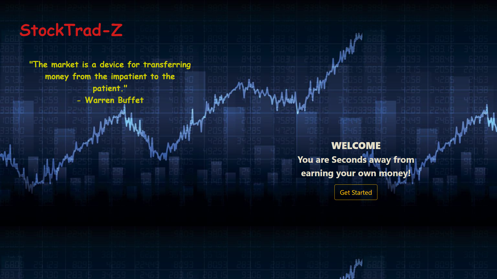

# Stock-Trading-Management
This Project is just a basic model of Stock Trading Management where buying and selling of stocks can be done,orders can be maintained.

# Output Screens
## Landing Page
This page is been made using [HTML](https://developer.mozilla.org/en-US/docs/Web/HTML#:~:text=HTML%20(HyperText%20Markup%20Language)%20is,functionality%2Fbehavior%20(JavaScript).), 
[CSS](https://developer.mozilla.org/en-US/docs/Web/CSS), [BOOTSTRAP](https://getbootstrap.com/) and [THEMELEAF](https://www.thymeleaf.org/).

## Welcome Page
This page is static for now but can be used to get news api and showing stock market news live.

## Stocks Page
The data used here is from database which you can find here [Stocks](https://github.com/modhtanmay/Stock-Trading-Management/blob/master/Share-Data/Sql%20Scripts/shares.sql). The improvement can be done where the data is dynamic using some stocks Apis. (will update it with necessary changes)

## Orders Page
Here the list of orders are seen which the trader traded from stocks Page. This is linked to database (For project management of data is using [JPA](https://spring.io/projects/spring-data-jpa) and database is [MySql Workbench](https://www.mysql.com/products/workbench/))

